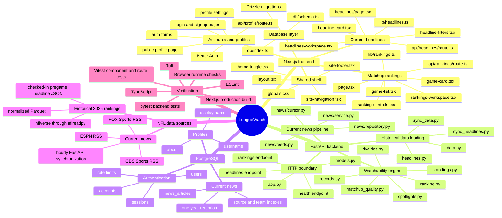
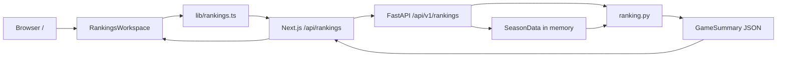
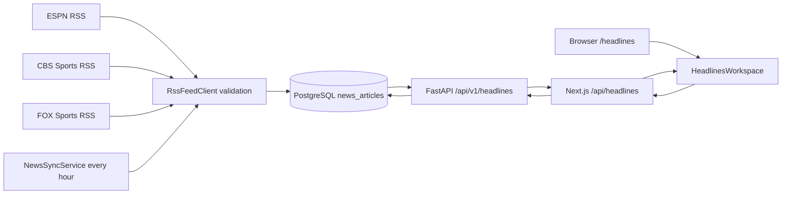
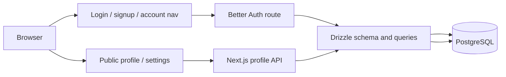

# LeagueWatch Codebase Mind Map

This map shows the current runtime boundaries and the files responsible for
each path. LeagueWatch has one browser application, one Python API, one shared
PostgreSQL database, and two intentionally separate NFL data pipelines.

## 1. Matchup ranking request

FastAPI loads the normalized 2024–2025 Parquet data at startup. Ranking
requests do not query PostgreSQL, nflverse, RSS feeds, or an MCP server.

## 2. Current headline request and refresh

Publisher requests happen only in the background scheduler. User requests read
stored rows from PostgreSQL with `(published_at, id)` cursor pagination.
Current RSS articles never enter the watchability formula or the historical
2025 pregame-headline cache.

## 3. Authentication and profile request

Authentication remains entirely inside Next.js. FastAPI never receives
passwords, session cookies, authentication tokens, or private email addresses.

## Important boundaries

- `frontend/src/app/api/*` are same-origin proxies or Next.js-owned account
  endpoints. The browser does not call FastAPI directly.
- `src/nflviewer/app.py` wires the Python runtime together; scoring logic stays
  in dedicated pure modules.
- `frontend/src/db/schema.ts` and `frontend/drizzle/` remain the migration
  authority for the shared PostgreSQL schema.
- The ranking path is in-memory and deterministic. The current-news path is
  PostgreSQL-backed and eventually consistent.
- Redis is not currently present. Ranking response caching and personalized
  ranking caches remain future work.
- The hourly news scheduler runs only while a FastAPI instance is running.

## Fast orientation

| Goal | Start here |
| --- | --- |
| Change the weekly score | `src/nflviewer/ranking.py` |
| Change team-quality calculations | `src/nflviewer/matchup_quality.py` |
| Change standings leverage | `src/nflviewer/standings.py` |
| Change the rankings interface | `frontend/src/components/rankings-workspace.tsx` |
| Change the live Headlines interface | `frontend/src/components/headlines/headlines-workspace.tsx` |
| Add or validate a news publisher | `src/nflviewer/news/feeds.py` |
| Change news persistence or pagination | `src/nflviewer/news/repository.py` |
| Change authentication | `frontend/src/lib/auth.ts` |
| Change public profiles | `frontend/src/lib/profiles.ts` |
| Change the database schema | `frontend/src/db/schema.ts` |
